<!-- GITHUB_STATS_START -->
<!-- Generated by scripts/update-github-stats.ts. Edits between these markers are overwritten. -->
<picture>
  <source media="(max-width: 600px) and (prefers-color-scheme: dark)" srcset="./assets/profile-card-mobile-dark.svg">
  <source media="(max-width: 600px)" srcset="./assets/profile-card-mobile-light.svg">
  <source media="(prefers-color-scheme: dark)" srcset="./assets/profile-card-dark.svg">
  
</picture>
<!-- GITHUB_STATS_END -->

  <em>Building, breaking, and learning across way too many domains.</em>

  <a href="https://spacesdrive.github.io/spacesdrive/"><code>$ open terminal</code></a> &nbsp;try <code>/help</code>, <code>/repos</code>, <code>/neofetch</code>

  <a href="https://tech.ujjwal.fyi">Website</a> &middot;
  <a href="https://resume.tech.ujjwal.fyi/">Resume</a> &middot;
  <a href="https://www.linkedin.com/in/u-k-r/">LinkedIn</a> &middot;
  <a href="https://medium.com/@ujjwal_kumar_rai">Medium</a> &middot;
  <a href="https://www.instagram.com/ujjwal.fyi">Instagram</a>

